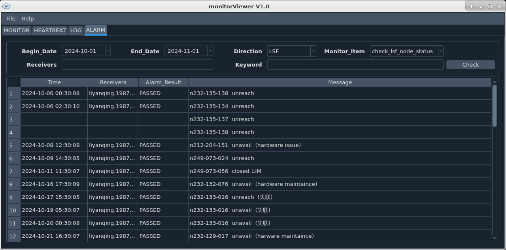
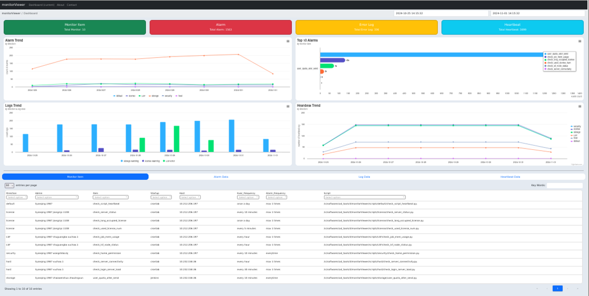

**Version:** V1.0

## What's monitorViewer?
monitorViewer includes a python framework for customing monitoring scripts and a set of information 
dashboards. Users can easily customize their monitoring items based on monitorViewer.

## Python dependency
Need python3.12.7
Install python library dependency with command

    pip install -r requirements.txt

## Install
Copy install package into install directory.
Execute below command under install directory.

    python3 install.py

## Demo
* Below is a demo of GUI dashboard.

   

* Below is a demo web dashboard.

   

## Configuration
Come into <MONITOR_VIEWER_INSTALL_PATH>/config directory,

  - Update "config.py" for monitorViewer basic configuration.

## Generate scripts
  - Suggest to generate custom monitoring script into scripts/<direction>/<monitor_item>.
  - Use python class "SaveLog" to save log and send alarm, the class is on common/common_monitor.py.
  - Startup scripts with crontab or Jenkins.

## View monitor items
  - Execute $MONITOR_VIEWER_INSTALL_PATH/bin/monitor_viewer to run view custom monitoring items (heartbeat/log/alarm). 

## Start web 
  - Execute $MONITOR_VIEWER_INSTALL_PATH/web/run.sh to start web. 

## Doc
More details please see ["docs/monitorViewer_user_manual.pdf"](./docs/monitorViewer_user_manual.pdf)

## Update history
***
|Version |Date       |Update content           |
|:-------|:----------|:------------------------|
| V1.0   |(2024.11)  |Release original version |
